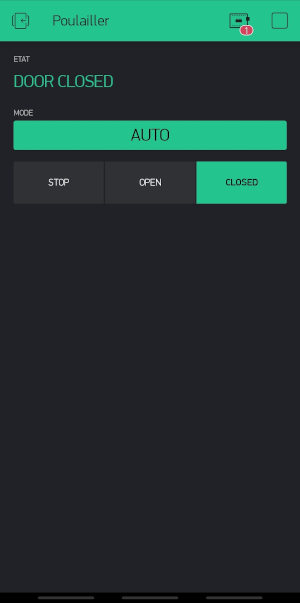

# Automatic chicken coop door controlled by an ESP8266 #

The purpose of this project is to control a chicken coop door with an ESP8266.  The main features are:
  - It should open and close the door based on the time of the day (thanks to a real-time clock module) and a predefined pattern.
  - It should open and close the door based on the sunrise/sunset (TODO).
  - it supports MQTT to report status, update its configuration, or manually controlling the door.
  - it can be controlled thanks to a specific [Blynk](https://blynk.io) mobile application.

Technically, it uses a DS1307 RTC module, a stepper motor, some stop contacts, saving of configuration in EEPROM...


The initial code is based on https://github.com/xluthi/pulse_counter_esp8266.

## Blynk ##

In order to control the door with Blynk, you need to create an account on [Blynk.cc](https://blynk.io) and create the application: this can be done easily by scanning this QR code in the Blynk application.




Once the app is created, add your device in it (via the config icon in the app), and copy your device token in the `private.h` file (you need to create this file, read below in the *configuration* section).

## MQTT ##

The following topics are defined (*my_hostname* is the ESP chipID (aka serial number) of the ESP8266):

1. house/hardware/ping_all
  * *Direction*: get
  * *answer*: house/hardware/ping_all/result: hostname of the ESP.
  * *Usage*:

    Specific topic that all hardware on the network must listen to and answer.
    It's a kind of discovery topic to have a view on active hardware.


2. house/hardware/my_hostname/do_reboot
  * *Direction*: set
  * *answer*: none
  * *payload*: none
  * *Usage*:

    Restart the ESP. It does not work after the first restart after serial flashing.
    However it works after manual reboot by power of RST switch.


3. house/hardware/my_hostname/do_upgrade
  * *direction*: set
  * *answer*: none
  * *payload*: the URL to download the firmware.
  * *Usage*:

     Launch firmware upgrade via HTTP download.  The payload is the HTTP URL to download the firmware.
     ! A priori, only HTTP works (no HTTPS)!


4. house/hardware/my_hostname/enable_mqtt_logs
  * *direction*: set
  * *answer*: none
  * *payload*: 0 --> disable log. Any other char --> enable logs
  * *usage*: Enable of disable MQTT verbose logs. Those are sent on house/hardware/my_hostname/log


5. house/hardware/my_hostname/get_config
  * *direction*: get
  * *answer*: Send on the log topic the following info: sensor topic, file compilation date and time, Wifi ssid
  * *payload*: none
  * *usage*: return some configuration and state information's


6. house/hardware/my_hostname/ctrl_led
    * *direction*: set
    * *answer*: none
    * *payload*: 0 -->Turn LED off.  Any other char --> turn the LED on.
    * *usage*: Test MQTT messaging by controlling builtin LED.

7. house/hardware/my_hostname/get_rtc
    * *direction*: get
    * *answer*: date&time,  e.g.: 2021-01-09 17:35:11
    * *payload*: none
    * *usage*: returns the current date & time from the RTC module.

8. house/hardware/my_hostname/set_rtc
    * *direction*: set
    * *answer*: none
    * *payload*: the date and time in the iso8601 format (e.g. 2020-06-25T15:29:37), without timezone info
    * *usage*: update the RTC module date and time.  On Linux, an easy way to generate the date & time with the correct format is `date +%Y-%m-%dT%T`.


## Compilation ##

In order to compile this sketch, you need a specific version of the PubSubClient: please download it on GitHub: https://github.com/xluthi/pubsubclient.  You'll also need to install RTClib from Adafruit (https://github.com/adafruit/RTClib) and the Blynk library (https://blynk.io).

Before compiling, create a `private.h` file based on the provided `private_example.h` file: it should contain your Wifi settings, the MQTT broker parameters, and your Blynk token.

The code contains a lot of debug statements. If those are not required, comment the `#define DEBUG` at the beginning of the main file.

### Using arduino-cli to compile

It is quite easy to use `arduino-cli` to compile this project.  Here is the list of operations:

1. prepare environment and install dependencies
```
curl -fsSL https://raw.githubusercontent.com/arduino/arduino-cli/master/install.sh | sh
arduino-cli core update-index
arduino-cli core install esp8266:esp8266
arduino-cli lib update-index
arduino-cli lib install RTClib
arduino-cli lib install Blynk
```

2. Compilation and upload in the board
```
arduino-cli compile --fqbn esp8266:esp8266:d1_mini chickencoopdoor_esp8266
arduino-cli upload -v -p /dev/ttyUSB0 --fqbn esp8266:esp8266:d1_mini chickencoopdoor_esp8266
```

3. Monitor the Serial connection in a terminal
```
stty -F /dev/ttyUSB0 raw 115200 && cat /dev/ttyUSB0
```
